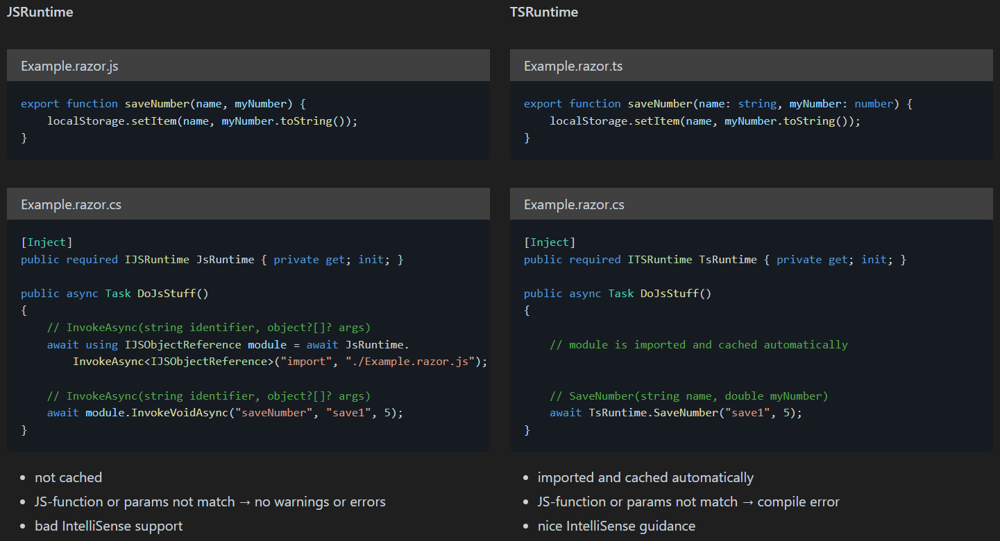

# TSRuntime

An improved JSRuntime with

- automatic JS-module loading and caching
- compile time errors instead of runtime errors
- IntelliSense guidance




<br></br>
## Available Methods

### Invoke

Each "export function" in typescript will generate up to 3 C#-methods:
- **Invoke** - interops synchronous
- **InvokeTrySync** - interops synchronous if possible, otherwise asynchronous
- **InvokeAsync** - interops asynchronous

```csharp
// "function name pattern" is configured: "#function##action#"
// ts-function is saveNumber(string name, int myNumber)

TsRuntime.SaveNumberInvoke("save1", 5); // will invoke sync
await TsRuntime.SaveNumberInvokeTrySync("save1", 5); // invokes sync if possible, otherwise async
await TsRuntime.SaveNumberInvokeAsync("save1", 5); // invokes async
```

**Note**:
- *InvokeTrySync* checks if IJSInProcessRuntime is available and if available, executes the call synchronous.
So, if the module is already be downloaded and IJSInProcessRuntime is available, this method executes synchronous.
- Asynchronous JavaScript-functions (JS-functions that return a promise) should be called with *InvokeAsync* (not *Invoke* or *InvokeTrySync*), otherwise the promise will not be awaited.
- *Invoke*-interop fails with an exception when module is not loaded.
So make sure to await the corresponding preload-method beforehand.

### Preload

Each module will generate a method to preload the module.
Additionaly, there is a *PreloadAllModules* method, that preloads all modules.
Preloading will start the download of the JS-module and the task completes when the module is downloaded and cached.  
If a JS-function is called before or while preloading, the download task will first be awaited before executing the function (A sync-call throws an exception).
Therefore, it is recommended to call this method as "fire and forget".
```csharp
_ = PreloadExample(); // loads and caches Example module in the background
_ = PreloadAllModules(); // loads and caches all modules in the background
```


<br></br>
## Get Started - Source Generator

TSRuntime included as source generator generates C#-methods on the fly:

- you write a TS-function
- saving .ts-file triggers the TS-compiler to generate files
- source generator detects file changes and generate C#-methods
- methods are available in your code with IntelliSense support

### 1. Setup TypeScript - tsconfig.json

If you want to use TSRuntime you have to use a TS-compiler.
There are many different compilers and ways to get this done, but if you are using Visual Studio, you get one out of the box.
You only need to add a tsconfig.json file.  
Create a **tsconfig.json** file in the same folder as your .csproj-file.  
Make sure you enable output for declaration-files: **"declaration": true**.

```json
{
  "compileOnSave": true,
  "compilerOptions": {
    "noImplicitAny": true,
    "strictNullChecks": true,
    "noEmitOnError": true,
    "removeComments": false,
    "sourceMap": false,
    "declaration": true,
    "target": "es6",
    "lib": [
      "es6",
      "DOM"
    ]
  },
  "exclude": [
    "bin",
    "obj",
    "Properties",
    "**/*.js",
    "**/*.jsx"
  ]
}
```


### 2. Add TSRuntime.SourceGenerator NuGet package

In your .csproj-file put a package reference to *TSRuntime.SourceGenerator*.

```xml
<ItemGroup>
  <PackageReference Include="TSRuntime.SourceGenerator" Version="x.x.x" PrivateAssets="all" />
</ItemGroup>
```


### 3. Add tsconfig.tsruntime.json

In your .csproj-file put an additional file directive to *tsconfig.tsruntime.json*.

```xml
<ItemGroup>
  <PackageReference Include="TSRuntime.SourceGenerator" Version="x.x.x" PrivateAssets="all" />
  <AdditionalFiles Include="tsconfig.tsruntime.json" />
</ItemGroup>
```

Create a *tsconfig.tsruntime.json*-file in the same folder as your .csproj-file.  
Your .csproj-file, tsconfig.json, tsconfig.tsruntime.json should be all in the same folder.

```json
{
  "module": {
    "invoke enabled": false,
    "trysync enabled": true,
    "async enabled": false
  },
  "function name pattern": {
    "pattern": "#function#",
    "function transform": "first upper case",
    "module transform": "none",
    "action transform": "none"
  }
}
```


### 4. Add ITSRuntime as dependency

If everything is set up correctly, the generator should already be generating the 2 files *TSRuntime*, *ITSRuntime*.  
Register them in your dependency container.

```csharp
using Microsoft.JSInterop;

services.AddScoped<ITSRuntime, TSRuntime>();
```


### Troubleshooting

make sure

- typescript is working correctly
- you are generating decalaration(.d.ts) files
- you have *&lt;PackageReference TSRuntime.SourceGenerator&gt;* in .csproj
- you have *&lt;AdditionalFiles&gt;* in .csproj
- you have a *tsconfig.tsruntime.json*-file
- you are using *Microsoft.JSInterop* namespace
- restart Visual Studio to reload the generator


<br></br>
## Get Started - Visual Studio Extension

not available yet


<br></br>
## Get Started - Programmatically Usage

You can also generate the class and interface by using *TSRuntime.Core* directly.

```xml
<ItemGroup>
  <PackageReference Include="TSRuntime.Core" Version="x.x.x" />
</ItemGroup>
```

The content of TSRuntime is constant, so to "generate" the class you only need to read the string *Generator.TSRuntimeContent*.

To generate the interface you need to do 3 steps:

- create a config-object
- parse the .d.ts-files
- generate ITSRuntime

```csharp
using TSRuntime.Core.Parsing;
using TSRuntime.Core.Configs;
using TSRuntime.Core.Generation;

// create a config-object
string json = File.ReadAllText("tsconfig.tsruntime.json");
Config config = Config.FromJson(json);

// parse the .d.ts-files
TSStructureTree structureTree = new();
await structureTree.ParseModules(config.DeclarationPath);

// generate ITSRuntime
using FileStream fileStream = new(config.FileOutputinterface, FileMode.Create, FileAccess.Write);
using StreamWriter streamWriter = new(fileStream);
foreach (string fragment in Generator.GetITSRuntimeContent(structureTree, config))
    await streamWriter.WriteAsync(fragment);

// save TSRuntime to file
await File.WriteAllTextAsync(config.FileOutputClass, Generator.TSRuntimeContent);
```

**Note**: *Generator.GetITSRuntimeContent* is an IEnumerable&lt;string&gt;, each enumeration executes the next part of the generation.
So, enumerating it to the end will give you the whole content of ITSRuntime.
The benefit of this design is that you can decide where to store the generation without the overhead of having a character-buffer.  
In the example it is directly written to disk, but you can also use a StringBuilder to save the generation to memory.


<br></br>
## Config - tsconfig.tsruntime.json

All available config keys with its default value:

```json
{
  "declaration path": "",
  "file output": {
    "class": "TSRuntime/TSRuntime.cs",
    "interface": "TSRuntime/ITSRuntime.cs"
  },
  "module": {
    "invoke enabled": false,
    "trysync enabled": true,
    "async enabled": false
  },
  "js runtime": {
    "invoke enabled": false,
    "trysync enabled": false,
    "async enabled": false
  },
  "promise function": {
    "only async enabled": true,
    "append Async": false
  },
  "function name pattern": {
    "pattern": "#function#",
    "module transform": "first upper case",
    "function transform": "first upper case",
    "action transform": "none"
  },
  "preload name pattern": {
    "pattern": "Preload#module#",
    "module transform": "first upper case"
  },
  "preload all modules name": "PreloadAllModules",
  "using statements": ["Microsoft.AspNetCore.Components"],
  "type map": {
    "number": "double",
    "boolean": "bool",
    "bigint": "long",
    "HTMLObjectElement": "ElementReference"
  }
}
```

- **[\[declaration path\]](#configure-declaration-files-dts-directory)**: Folder where to locate the d.ts declaration files. Path relative to this file and no starting or ending slash.
- **[file output].[class]**: File-path of TSRuntime. Path relative to json-file and no starting slash. Not used in source generator.
- **[file output].[interface]**: File-path of ITSRuntime. Path relative to json-file and no starting slash. Not used in source generator.
- **[module].[invoke enabled]**: Toggles whether sync invoke methods should be generated for modules.
- **[module].[trysync enabled]**: Toggles whether try-sync invoke methods should be generated for modules.
- **[module].[async enabled]**: Toggles whether async invoke methods should be generated for modules.
- **[js runtime].[invoke enabled]**: Toggles whether generic JSRuntime sync invoke method should be generated.
- **[js runtime].[trysync enabled]**: Toggles whether generic JSRuntime try-sync invoke method should be generated.
- **[js runtime].[async enabled]**: Toggles whether generic JSRuntime async invoke method should be generated.
- **[\[promise function\].\[only async enabled\]](#promise-function)**: Generates only async invoke method when return-type is promise.
- **[\[promise function\].\[append Async\]](#promise-function)**: Appends to the name 'Async' when return-type is promise.
- **[\[function name pattern\].\[pattern\]](#name-pattern)**: Naming of the generated methods that invoke module functions.
- **[\[function name pattern\].\[function transform\]](#name-pattern)**: Lower/Upper case transform for the variable #function#.
- **[\[function name pattern\].\[module transform\]](#name-pattern)**: Lower/Upper case transform for the variable #module#.
- **[\[function name pattern\].\[action transform\]](#name-pattern)**: Lower/Upper case transform for the variable #action#.. 
- **[\[preload name pattern\].\[pattern\]](#name-pattern)**: Naming of the generated methods that preloads a specific module.
- **[\[preload name pattern\].\[module transform\]](#name-pattern)**: Lower/Upper case transform for the variable #module#.
- **[\[preload all modules name\]](#name-pattern)**: Naming of the method that preloads all modules.
- **[\[using statements\]](#using-statements)**: List of generated using statements at the top of ITSRuntime.
- **[\[type map\]](#type-map)**: Mapping of typescript-types (key) to C#-types (value). Not listed types are mapped unchanged (Identity function).


### Promise Function


**[only async enabled]**: If true, whenever a module function returns a promise, the *[module].[invoke enabled]*, *[module].[trysync enabled]* and *[module].[async enabled]* flags will be ignored
and instead, only the async invoke method will be generated.  
Asynchronous JS-functions will only be awaited with the async invoke method, so this value should always be true.
Set it only to false when you know what you are doing.

**[append Async]**: Whenever a module function returns a promise, the string "Async" is appended.  
If your pattern ends already with "Async", for example with the #action# variable, this will result in a double: "AsyncAsync".


### Name Pattern

[function name pattern] describes the naming of the generated invoke methods.
For example, if you provide for the key [pattern] the value "MyMethod", all generated methods will have the name "MyMethod", which will result in a compile error.
That is why there are 3 variables provided to customize your method-naming:

- #function#
- #module#
- #action#

Let's say we have a module named "Example" and a function "saveNumber":

- "pattern": "#function##Example##action#":  
  -> saveNumberExampleInvoke(...)  
  -> saveNumberExampleInvokeTrySync(...)  
  -> saveNumberExampleInvokeAsync(...)

- "pattern": "#action#_text#function#":  
  -> Invoke_textsaveNumber(...)  
  -> InvokeTrySync_textsaveNumber(...)  
  -> InvokeAsync_textsaveNumber(...)

Like in the example JS-functions are normally lower case and in C# most things are upper case.
To handle that you can apply lower/upper case transformation for each variable.  
NameTransform can be one of 5 different values:

- **"none"**: identity, changes nothing
- **"first upper case"**: first letter is uppercase
- **"first lower case"**: first letter is lowercase
- **"upper case"**: all letters are uppercase
- **"lower case"**: all letters are lowercase

With [function transform] set to "first upper case" you get:

- "pattern": "#function##Example##action#":  
  -> SaveNumberExampleInvoke(...)  
  -> SaveNumberExampleInvokeTrySync(...)  
  -> SaveNumberExampleInvokeAsync(...)

- "pattern": "#action#_text#function#":  
  -> Invoke_textSaveNumber(...)  
  -> InvokeTrySync_textSaveNumber(...)  
  -> InvokeAsync_textSaveNumber(...)

[preload name pattern] works pretty much the same, except there is only 1 variable:

- #module#


### Using Statements

The following using statements are always included

- using Microsoft.JSInterop.Infrastructure;
- using System.Diagnostics.CodeAnalysis;
- using System.Threading;
- using System.Threading.Tasks;

The values given in \[using statements] will add additional using statements.


### Type Map

Variants of nullable or optional are not concidered as different types.
If a TS-variable is nullable, it is also nullable in C#.
If a TS-variable is optional/undefined, it is also optional in C# by creating overload methods, but only if the last parameters are optional/undefined.
If an array item is undefined, it is treated like nullable.

e.g. Assuming *bigint* is mapped to *long*

| TypeScript                                               | C#                             |
| -------------------------------------------------------- | ------------------------------ |
| do(myParameter: bigint)                                  | Do(long myParameter)           |
| do(myParameter: bigint \| null)                          | Do(long? myParameter)          |
| do(myParameter?: bigint)                                 | Do(), Do(long myParameter)     |
| do(myParameter: bigint \| undefined)                     | Do(), Do(long myParameter)     |
| do(myParameter?: bigint \| undefined)                    | Do(), Do(long myParameter)     |
| do(myParameter?: bigint \| null)                         | Do(), Do(long? myParameter)    |
| do(myParameter: bigint \| null \| undefined)             | Do(), Do(long? myParameter)    |
| do(myParameter: (bigint \| null)[])                      | Do(long?[] myParameter)        |
| do(myParameter: (bigint \| undefined)[])                 | Do(long?[] myParameter)        |
| do(myParameter: (bigint \| null \| undefined)[])         | Do(long?[] myParameter)        |
| do(myParameter: (bigint \| null)[] \| null)              | Do(), Do(long?[]? myParameter) |
| do(myParameter: (bigint \| null)[] \| undefined)         | Do(), Do(long?[] myParameter)  |
| do(myParameter: (bigint \| null)[] \| null \| undefined) | Do(), Do(long?[]? myParameter) |

**Note**: default value parameters (e.g. do(myParameter = 5)) are automatically mapped to optional parameters in .d.ts-files, so they will work as expected.


<br></br>
## Configure declaration-files (.d.ts) directory

The generated declaration files do not hide behind your .razor files and can make your folders look dirty/clunky.
To solve that problem you can configure a declaration directory in tsconfig.json and tsconfig.tsruntime.json.  
If the name of your folder starts with a ".", the folder does not even show up in Visual Studio.

```json
// tsconfig.json
{
  "compilerOptions": {
    "declaration": true,
    "declarationDir": ".typescript-declarations",
    ...
  },
  ...
}
```

```json
// tsconfig.tsruntime.json
{
  "declaration path": ".typescript-declarations",
  ...
}
```


### [declaration path] in depth
The value for [declaration path] is actually much more than a string. Setting it to the string ".typescript-declarations" is just a shorthand for:

```json
{
  "declaration path": [
    {
      "include": ".typescript-declarations",
      "excludes": [],
      "file module path": null
    }
  ]
}
```

So, you can have a list of include paths. Each path can be a folder or a file.  
Each include path can have a list of exclude paths, each can be a folder or a file.
An exclude path must start with the same as include path in order to match.

**Example**:  
```json
{
  "declaration path": [
    {
      "include": ".typescript-declarations",
      "excludes": [
        ".typescript-declarations/private",
        ".typescript-declarations/wwwroot/service-worker.d.ts"
      ]
    },
    "otherDeclarationFolder"
  ]
}
```

The preceding configuration has two include paths ".typescript-declarations" and "otherDeclarationFolder" and inside ".typescript-declarations" the folder "private" and inside "wwwroot" the file "service-worker.d.ts" will not be included.

If your include path is a file, the module path will be the same as your include path.
If that path does not fit, you can set it explicit with [file module path].

**Example**:  
```json
{
  "declaration path": {
    "include": "scripts/declarations/shared.d.ts",
    "file module path": "/scripts/shared.js"
  }
}
```

The preceding configuration only reads in one module: "shared.d.ts".
If [file module path] would be not set, the module path would be "/scripts/declarations/shared.js".
Because the actual script is served on the URL "/scripts/shared.js", it has to be set explicitly.

Setting explicit module path for folders is not supported.


### Troubleshooting

Setting in *tsconfig.json* [declarationDir] does **not work** if you only have 1 module.
You need to have **at least 2 modules in different folders** before this method is working properly.  
The problem is, that the TS-compiler does not preserve the folder structure as long as there is only 1 folder path involved.
If there is only 1 path, the declaration files are just created at the root level, so the generator will determine the wrong module path (except your module is in the wwwroot folder).
As soon as you have 2 modules in different folders, the TS-compiler creates the corresponding folder structure and put the declaration files properly, so the generator can work properly.

If you get an error like "*Type 'ITSRuntime' already defines a member called '...' with the same parameter types*", you have most likely duplicate files in your declaration folder.
Check your declaration folder and remove any exceeding files.


<br></br>
## Preview

This package is in preview and breaking changes may occur.

There are some features planned (no guarantees whatsoever):

* module grouping in seperate interfaces
* option in config: generate on save (not used in source generator)
* TypeMapDefault more default types (e.g. Uint8Array -> byte[], DotNetStreamReference -> DotNetStreamReference)
* Generic type-mapping (INumber&lt;T&gt; instead of double)
* Generic TS-Functions

- TSRuntime as VS-Extension
- map callbacks <-> delegates
- improved parser (summary, .ts, .js with JSDocs)
- support for non-module files

* [JSImport]/[JSExport] interop


<br></br>
## Release Notes

- 0.0.1  
  First version. Includes all basic functionalities for generating TSRuntime.
- 0.1  
  Improved declaration path: Instead of one include string, an array of objects { "include": string, "excludes": string[], "file module path": string } is now supported.
- 0.2  
  Optional parameters and default parameter values are now supported.
