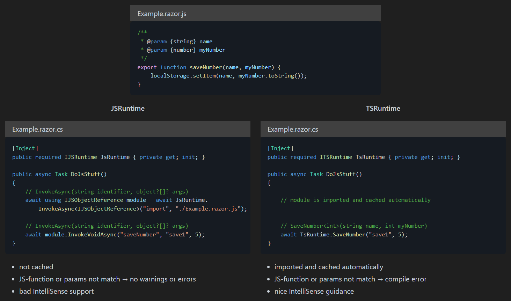

# Blazor.TSRuntime

An improved JSRuntime with

- automatic JS-module loading and caching
- compile time errors instead of runtime errors
- IntelliSense guidance




<br></br>
## Available Methods

### Invoke

Each "export function" in TypeScript will generate up to 3 C#-methods:
- **Invoke** - interops synchronous
- **InvokeTrySync** - interops synchronous if possible, otherwise asynchronous
- **InvokeAsync** - interops asynchronous

```csharp
// "function name pattern" is configured: "#function##action#"
// ts-function is saveNumber(string name, int myNumber)

TsRuntime.SaveNumberInvoke("key1", 5); // will invoke sync
await TsRuntime.SaveNumberInvokeTrySync("key1", 5); // invokes sync if possible, otherwise async
await TsRuntime.SaveNumberInvokeAsync("key1", 5); // invokes async
```

**Note**:
- *InvokeTrySync* checks if IJSInProcessRuntime is available and if available, executes the call synchronous.
So, if the module is already be downloaded and IJSInProcessRuntime is available, this method executes synchronous.
- Asynchronous JavaScript-functions (JS-functions that return a promise) should be called with *InvokeAsync* (not *Invoke* or *InvokeTrySync*), otherwise the promise will not be awaited.
- *Invoke*-interop fails with an exception when module is not loaded.
So make sure to await the corresponding preload-method beforehand.

### Preload

Each module will generate a method to preload the module.
Additionaly, there is a *PreloadAllModules* method, that preloads all modules.
Preloading will start the download of the JS-module and the task completes when the module is downloaded and cached.  
If a JS-function is called before or while preloading, the download task will first be awaited before executing the function (A sync-call throws an exception).
Therefore, it is recommended to call this method as "fire and forget".
```csharp
_ = PreloadExample(); // loads and caches Example module in the background
_ = PreloadAllModules(); // loads and caches all modules in the background
await PreloadAllModules(); // awaits the loading of all modules, recommended when using sync-interop
```

Furthermore you can prefetch your modules into JavaScript, so the Preload-methods will only get a reference to the module.
```html
<head>
  ...
  <link rel="modulepreload" href="Page/Example.razor.js" />
</head>
```


<br></br>
## Get Started

### 1. Setup TypeScript - tsconfig.json

If you want to use TSRuntime you have to use a TS-compiler.
There are many different compilers and ways to get this done, but if you are using Visual Studio, you get one out of the box.
You only need to add a tsconfig.json file.  
Create a **tsconfig.json** file in the same folder as your .csproj-file.  
Make sure you enable output for declaration-files: **"declaration": true**.

```json
{
  "compileOnSave": true,
  "compilerOptions": {
    "noImplicitAny": true,
    "strictNullChecks": true,
    "noEmitOnError": true,
    "removeComments": false,
    "sourceMap": false,
    "declaration": true,
    "target": "es6",
    "lib": [
      "es6",
      "DOM"
    ]
  },
  "exclude": [
    "bin",
    "obj",
    "Properties",
    "**/*.js",
    "**/*.jsx"
  ]
}
```


### 2. Add Blazor.TSRuntime NuGet package

In your .csproj-file put a package reference to *Blazor.TSRuntime*.

```xml
<ItemGroup>
  <PackageReference Include="Blazor.TSRuntime" Version="{latest version}" PrivateAssets="all" />
</ItemGroup>
```


### 3. Add tsruntime.json

In your .csproj-file put an &lt;AdditionalFiles&gt; directive to *tsconfig.tsruntime.json*
and an &lt;AdditionalFiles&gt; make all .d.ts-files available to the source-generator.

```xml
<ItemGroup>
  <PackageReference Include="Blazor.TSRuntime" Version="{latest version}" PrivateAssets="all" />
  <AdditionalFiles Include="tsconfig.tsruntime.json" />
  <AdditionalFiles Include="**\*.d.ts" />
</ItemGroup>
```

Create a *tsconfig.tsruntime.json*-file in the same folder as your .csproj-file.  
Your .csproj-file, tsconfig.json, tsconfig.tsruntime.json should be all in the same folder.

```json
{
  "invoke function": {
    "sync enabled": false,
    "trysync enabled": true,
    "async enabled": false,
    "name pattern": {
      "pattern": "#function#",
      "module transform": "first upper case",
      "function transform": "first upper case",
      "action transform": "none"
    },
    "type map": {
      "number": {
        "type": "TNumber",
        "generic types": {
          "name": "TNumber",
          "constraint": "INumber<TNumber>"
        }
      },
      "boolean": "bool",
      "Uint8Array": "byte[]",
      "HTMLElement": "ElementReference"
    }
  }
}
```


### 4. Register ITSRuntime

If everything is set up correctly, the generator should already be generating the 2 files *TSRuntime*, *ITSRuntime*.  
Register them in your dependency container.

```csharp
using Microsoft.JSInterop;

services.AddScoped<ITSRuntime, TSRuntime>();
```

### 5. Use It

Now you are ready to rumble, to make a "Hello World" test you can create 2 files:

- Example.razor

```razor
<button @onclick="InvokeJS">

@code {
    [Inject]
    public required ITSRuntime TsRuntime { private get; init; }
    
    private Task InvokeJS() => TsRuntime.Example();
}
```

- Example.razor.ts

```js
export function example() {
    console.log("Hello World");
}
```


### Troubleshooting

make sure

- TypeScript is working correctly
- you are generating decalaration(.d.ts) files
- you have *&lt;PackageReference Blazor.TSRuntime&gt;* in .csproj
- you have *&lt;AdditionalFiles&gt;* in .csproj
- you have a *tsconfig.tsruntime.json*-file
- you are using *Microsoft.JSInterop* namespace
- restart Visual Studio to reload the generator

Note:  
To recognize a module the file must end with ".d.ts".
Function definitions in the module must be placed at the start of a line
and must start with "export function" or "export declare function".
Futhermore a function definition must not contain any line breaks and the number of whitespace also matters.


<br></br>
## Config - tsconfig.tsruntime.json

All available config keys with its default value:

```json
{
  "webroot path": "",
  "input path": {
    "include": "",
    "excludes": [ "bin", "obj", "Properties" ]
  },
  "using statements": [ "Microsoft.AspNetCore.Components", "System.Numerics" ],
  "invoke function": {
    "sync enabled": false,
    "trysync enabled": true,
    "async enabled": false,
    "name pattern": {
      "pattern": "#function#",
      "module transform": "first upper case",
      "function transform": "first upper case",
      "action transform": "none",
      "action name": {
        "sync": "Invoke",
        "trysync": "InvokeTrySync",
        "async": "InvokeAsync"
      }
    },
    "promise": {
      "only async enabled": true,
      "append async": false
    },
    "type map": {
      "number": {
        "type": "TNumber",
        "generic types": {
          "name": "TNumber",
          "constraint": "INumber<TNumber>"
        }
      },
      "boolean": "bool",
      "Uint8Array": "byte[]",
      "HTMLElement": "ElementReference"
    }
  },
  "preload function": {
    "name pattern": {
      "pattern": "Preload#module#",
      "module transform": "first upper case"
    },
    "all modules name": "PreloadAllModules",
  },
  "module grouping": {
    "enabled": false,
    "interface name pattern": {
      "pattern": "I#module#Module",
      "module transform": "first upper case"
    }
  },
  "js runtime": {
    "sync enabled": false,
    "trysync enabled": false,
    "async enabled": false
  },
  "service extension": true
}
```

- **[\[webroot path\]](Readme_md/InputPath.md)**:
 Relative path to the web root (starting folder 'wwwroot' is ignored).
- **[\[input path\]](Readme_md/InputPath.md)**:
 Folder where to locate the input files. Path relative to json-file and no starting or ending slash.
- **[\[using statements\]](Readme_md/UsingStatements.md)**:
 List of generated using statements at the top of ITSRuntime.
- **[\[invoke function\].\[sync enabled\]](#invoke)**:
 Toggles whether sync invoke methods should be generated for modules.
- **[\[invoke function\].\[trysync enabled\]](#invoke)**:
 Toggles whether try-sync invoke methods should be generated for modules.
- **[\[invoke function\].\[async enabled\]](#invoke)**:
 Toggles whether async invoke methods should be generated for modules.
- **[\[invoke function\].\[name pattern\].\[pattern\]](Readme_md/NamePattern.md)**:
 Naming of the generated methods that invoke module functions.
- **[\[invoke function\].\[name pattern\].\[module transform\]](Readme_md/NamePattern.md)**:
 Lower/Upper case transform for the variable #module#.
- **[\[invoke function\].\[name pattern\].\[function transform\]](Readme_md/NamePattern.md)**:
 Lower/Upper case transform for the variable #function#.
- **[\[invoke function\].\[name pattern\].\[action transform\]](Readme_md/NamePattern.md)**:
 Lower/Upper case transform for the variable #action#.. 
- **[\[invoke function\].\[name pattern\].\[action name\]\[sync\]](Readme_md/NamePattern.md)**:
 Naming of the #action# variable for the invoke module functions name pattern when the action is synchronous.
- **[\[invoke function\].\[name pattern\].\[action name\]\[trysync\]](Readme_md/NamePattern.md)**:
 Naming of the #action# variable for the invoke module functions name pattern when the action is try synchronous.
- **[\[invoke function\].\[name pattern\].\[action name\]\[async\]](Readme_md/NamePattern.md)**:
 Naming of the #action# variable for the invoke module functions name pattern when the action is asynchronous.
- **[\[invoke function\].\[promise\].\[only async enabled\]](Readme_md/PromiseFunction.md)**:
 Generates only async invoke method when return-type is promise.
- **[\[invoke function\].\[promise\].\[append async\]](Readme_md/PromiseFunction.md)**:
 Appends to the name 'Async' when return-type is promise.
- **[\[invoke function\].\[type map\]](Readme_md/TypeMap.md)**:
 Mapping of TypeScript-types (key) to C#-types (value). Not listed types are mapped unchanged (Identity function).
- **[\[preload function\].\[name pattern\].\[pattern\]](Readme_md/NamePattern.md)**:
 Naming of the generated methods that preloads a specific module.
- **[\[preload function\].\[name pattern\].\[module transform\]](Readme_md/NamePattern.md)**:
 Lower/Upper case transform for the variable #module#.
- **[\[preload function\].\[all modules name\]](Readme_md/NamePattern.md)**:
 Naming of the method that preloads all modules.
- **[\[module grouping\].\[enabled\]](Readme_md/ModuleGrouping.md)**:
 Each module gets it own interface and the functions of that module are only available in that interface.
- **[\[module grouping\].\[interface name pattern\].\[pattern\]](Readme_md/NamePattern.md)**:
 Naming of the generated module interfaces when *module grouping* is enabled.
- **[\[module grouping\].\[interface name pattern\].\[module transform\]](Readme_md/NamePattern.md)**:
 Lower/Upper case transform for the variable #module#.
- **[\[js runtime\].\[sync enabled\]](Readme_md/JSRuntime.md)**:
 Toggles whether generic JSRuntime sync invoke method should be generated.
- **[\[js runtime\].\[trysync enabled\]](Readme_md/JSRuntime.md)**:
 Toggles whether generic JSRuntime try-sync invoke method should be generated.
- **[\[js runtime\].\[async enabled\]](Readme_md/JSRuntime.md)**:
 Toggles whether generic JSRuntime async invoke method should be generated.
- **[\[service extension\]](Readme_md/ModuleGrouping.md)**:
 A service extension method is generated, which registers ITSRuntime and if available, the module interfaces.


<br></br>
## Preview

This package is in preview and breaking changes may occur.

There are some features planned (no guarantees whatsoever):

- map .d.ts summary <-> .cs summary
- add JSDocs Parser
- support for non-module files
- map callbacks <-> delegates


<br></br>
## Release Notes

- 0.0.1  
  First version. Includes all basic functionalities for generating TSRuntime.
- 0.1  
  Improved declaration path: Instead of one include string, an array of objects { "include": string, "excludes": string[], "file module path": string } is now supported.
- 0.2  
  Optional parameters and default parameter values are now supported.
- 0.3  
  Breaking changes: changed config keys, defaults and properties in Config, changed Config.FromJson(string json) to new Config(string json).  
  Added key "generate on save" and "action name" keys to config.
- 0.4  
  Module grouping is now supported. Small breaking change: A namespace that contains IServiceCollection is required when serviceExtension is enabled and namespace *Microsoft.Extensions.DependencyInjection* was added to the defaults.
- 0.5  
  Generics in type map is now supported.
- 0.6  
  huge Refactoring, many breaking changes:
  - renamed the project, repository and NuGet package to "Blazor.TSRuntime" (before it was "TSRuntime")
  - dropped *Programmatically Usage* and *Visual Studio Extension*, only *Source Generator* will be continued -> reduced project structure to 2 projects.
  - changed ISourceGenerator to IIncrementalGenerator
    - *tsconfig.tsruntime.json* can now be named *\*.tsruntime.json*
    - .d.ts-files must be added with *&lt;AdditionalFiles Include="\*\*\\\*.d.ts" /&gt;*
  - added config key *webroot path*
  - moved config key *[module grouping].[service extension]* to *[service extension]*
  - renamed key "declaration path" to "input path"
  - renamed key "file module path" to "module path"
  - renamed key "append Async" to "append async"
  - Config.InputPath.ModulePath must end with ".js"
